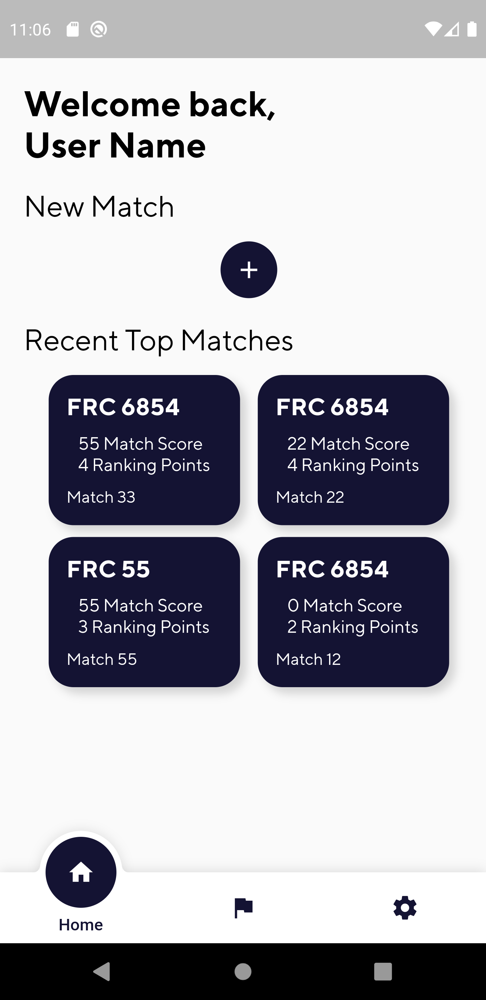
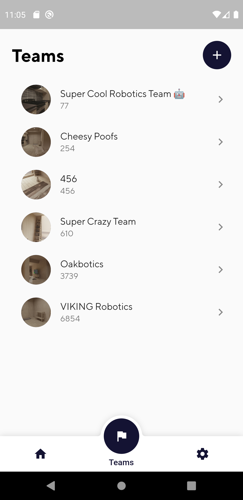
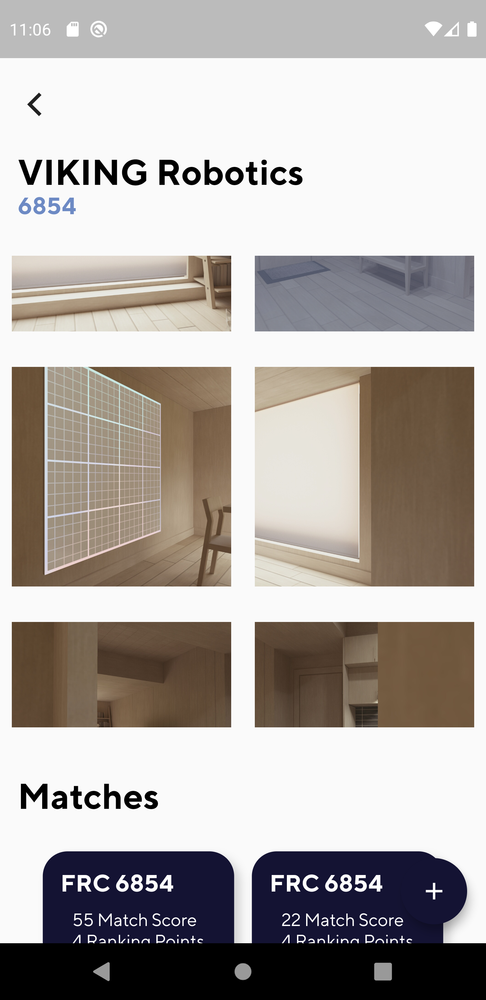
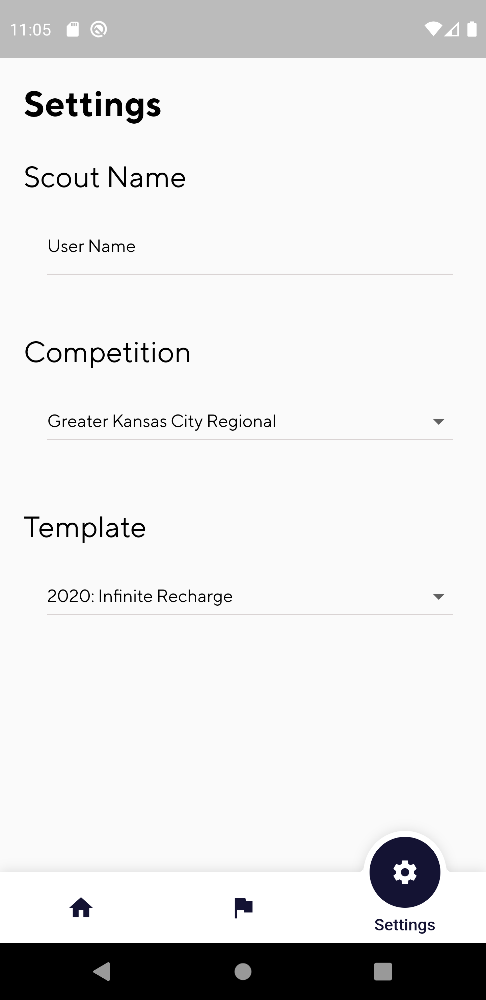

# VIKING Scouter

Open-source scouting app for FRC. Built using Flutter. Built with cross-platform in mind, while also staying offline.

 

## Images

</img>
</img>
</img>
</img>

 

## Features

 

### Scouting 📃
- Match scouting using templates
- Ability to share data to Google Drive or through Bluetooth Serial
- Metrics:
    - Header
    - Bubble Tab (True/False)
    - Stopwatch
    - Counter
    - Number Input
    - Text Input

### Templates 📋
- Customizable templates
- Built-in templates for current year

### Planned
- Pit Scouting
- Bluetooth Support
- Share Support

